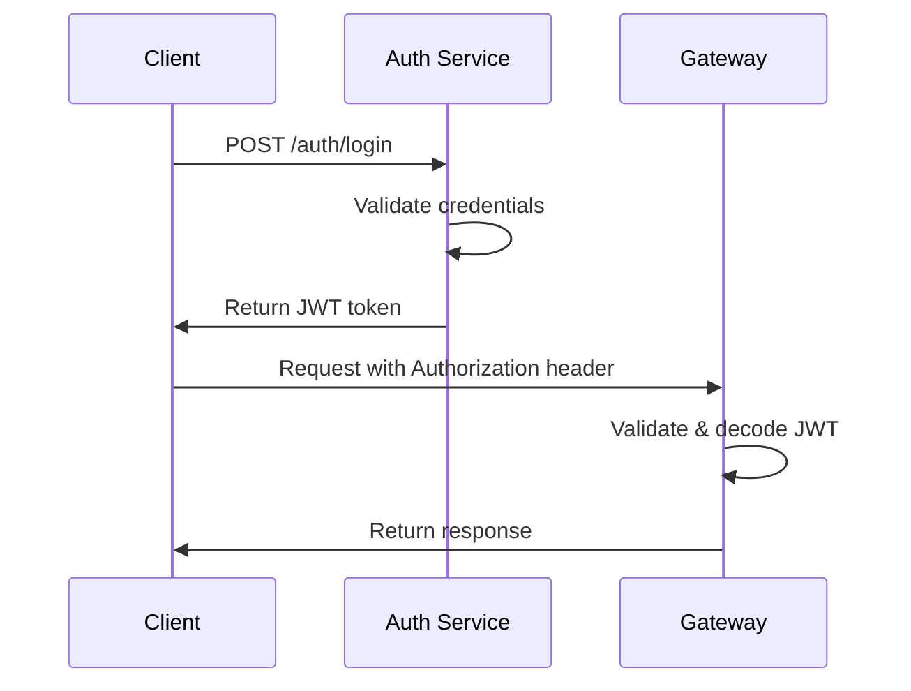

# API Documentation - Zplus SaaS

## 1. Tổng quan API

Zplus SaaS cung cấp hai loại API:
- **GraphQL API** (Primary): Flexible queries, real-time subscriptions
- **REST API** (Secondary): Simple operations, third-party integrations

### Base URLs

| Environment | GraphQL | REST | WebSocket |
|-------------|---------|------|-----------|
| **Development** | `http://localhost:8080/graphql` | `http://localhost:8080/api/v1` | `ws://localhost:8080/graphql` |
| **Staging** | `https://api-staging.zplus.com/graphql` | `https://api-staging.zplus.com/api/v1` | `wss://api-staging.zplus.com/graphql` |
| **Production** | `https://api.zplus.com/graphql` | `https://api.zplus.com/api/v1` | `wss://api.zplus.com/graphql` |

## 2. Authentication

### 2.1 JWT Token Structure

```json
{
  "sub": "user_id",
  "tenant_id": "tenant_slug",
  "email": "user@example.com",
  "roles": ["admin", "user"],
  "permissions": [
    "customers:read",
    "customers:write",
    "products:read"
  ],
  "exp": 1640995200,
  "iat": 1640908800
}
```

### 2.2 Authentication Flow



### 2.3 Headers

**Required Headers:**
```http
Authorization: Bearer <jwt_token>
X-Tenant-ID: <tenant_slug>
Content-Type: application/json
```

**Optional Headers:**
```http
X-Request-ID: <unique_request_id>
Accept-Language: vi,en
```

## 3. GraphQL API

### 3.1 Schema Overview

```graphql
# Root types
type Query {
  # System Level
  tenants(filter: TenantFilter): [Tenant!]!
  plans: [Plan!]!
  
  # Tenant Level
  users(filter: UserFilter): [User!]!
  customers(filter: CustomerFilter): [Customer!]!
  
  # Module Specific
  products(filter: ProductFilter): [Product!]!
  orders(filter: OrderFilter): [Order!]!
}

type Mutation {
  # Authentication
  login(input: LoginInput!): AuthPayload!
  logout: Boolean!
  
  # Tenant Management
  createTenant(input: CreateTenantInput!): Tenant!
  updateTenant(id: ID!, input: UpdateTenantInput!): Tenant!
  
  # User Management
  createUser(input: CreateUserInput!): User!
  updateUser(id: ID!, input: UpdateUserInput!): User!
  deleteUser(id: ID!): Boolean!
}

type Subscription {
  # Real-time notifications
  notifications(tenantId: ID!): Notification!
  
  # Live updates
  userStatusChanged(tenantId: ID!): User!
  orderUpdated(tenantId: ID!): Order!
}
```

### 3.2 Common Types

**TenantEntity Interface:**
```graphql
interface TenantEntity {
  id: ID!
  tenantId: ID!
  createdAt: DateTime!
  updatedAt: DateTime!
}
```

**User Type:**
```graphql
type User implements TenantEntity {
  id: ID!
  tenantId: ID!
  email: String!
  name: String!
  avatar: String
  status: UserStatus!
  roles: [Role!]!
  permissions: [Permission!]!
  lastLoginAt: DateTime
  createdAt: DateTime!
  updatedAt: DateTime!
}

enum UserStatus {
  ACTIVE
  INACTIVE
  SUSPENDED
}
```

**Customer Type:**
```graphql
type Customer implements TenantEntity {
  id: ID!
  tenantId: ID!
  name: String!
  email: String
  phone: String
  company: String
  status: CustomerStatus!
  tags: [String!]!
  customFields: JSON
  createdAt: DateTime!
  updatedAt: DateTime!
}

enum CustomerStatus {
  LEAD
  PROSPECT
  ACTIVE
  INACTIVE
  CHURNED
}
```

### 3.3 Sample Queries

**Get Current User:**
```graphql
query GetCurrentUser {
  me {
    id
    name
    email
    avatar
    roles {
      id
      name
      permissions {
        id
        resource
        action
      }
    }
  }
}
```

**Get Customers with Pagination:**
```graphql
query GetCustomers($filter: CustomerFilter, $pagination: PaginationInput) {
  customers(filter: $filter, pagination: $pagination) {
    nodes {
      id
      name
      email
      phone
      company
      status
      createdAt
    }
    pageInfo {
      hasNextPage
      hasPreviousPage
      startCursor
      endCursor
    }
    totalCount
  }
}
```

**Variables:**
```json
{
  "filter": {
    "status": "ACTIVE",
    "search": "john"
  },
  "pagination": {
    "first": 20,
    "after": "cursor_here"
  }
}
```

### 3.4 Sample Mutations

**Create Customer:**
```graphql
mutation CreateCustomer($input: CreateCustomerInput!) {
  createCustomer(input: $input) {
    id
    name
    email
    status
    createdAt
  }
}
```

**Variables:**
```json
{
  "input": {
    "name": "John Doe",
    "email": "john@example.com",
    "phone": "+84901234567",
    "company": "ABC Corp",
    "tags": ["vip", "enterprise"]
  }
}
```

**Update User Roles:**
```graphql
mutation UpdateUserRoles($userId: ID!, $roleIds: [ID!]!) {
  updateUserRoles(userId: $userId, roleIds: $roleIds) {
    id
    roles {
      id
      name
    }
  }
}
```

### 3.5 Subscriptions

**Real-time Notifications:**
```graphql
subscription NotificationUpdates($tenantId: ID!) {
  notifications(tenantId: $tenantId) {
    id
    type
    title
    message
    data
    createdAt
  }
}
```

**Live Customer Updates:**
```graphql
subscription CustomerUpdates($tenantId: ID!) {
  customerUpdated(tenantId: $tenantId) {
    id
    name
    status
    updatedAt
  }
}
```

## 4. REST API

### 4.1 Authentication Endpoints

**Login:**
```http
POST /api/v1/auth/login
Content-Type: application/json

{
  "email": "user@example.com",
  "password": "password123"
}
```

**Response:**
```json
{
  "success": true,
  "data": {
    "token": "eyJhbGciOiJIUzI1NiIsInR5cCI6IkpXVCJ9...",
    "refreshToken": "refresh_token_here",
    "expiresIn": 86400,
    "user": {
      "id": "user_id",
      "name": "John Doe",
      "email": "user@example.com"
    }
  }
}
```

**Refresh Token:**
```http
POST /api/v1/auth/refresh
Content-Type: application/json

{
  "refreshToken": "refresh_token_here"
}
```

**Logout:**
```http
POST /api/v1/auth/logout
Authorization: Bearer <token>
```

### 4.2 User Management

**Get Users:**
```http
GET /api/v1/users?page=1&limit=20&search=john&status=active
Authorization: Bearer <token>
X-Tenant-ID: tenant_slug
```

**Response:**
```json
{
  "success": true,
  "data": {
    "users": [
      {
        "id": "user_id",
        "name": "John Doe",
        "email": "john@example.com",
        "status": "active",
        "roles": ["admin"],
        "createdAt": "2024-01-01T00:00:00Z"
      }
    ],
    "pagination": {
      "page": 1,
      "limit": 20,
      "total": 100,
      "totalPages": 5
    }
  }
}
```

**Create User:**
```http
POST /api/v1/users
Authorization: Bearer <token>
X-Tenant-ID: tenant_slug
Content-Type: application/json

{
  "name": "Jane Doe",
  "email": "jane@example.com",
  "password": "password123",
  "roleIds": ["role_id_1", "role_id_2"]
}
```

**Update User:**
```http
PUT /api/v1/users/{user_id}
Authorization: Bearer <token>
X-Tenant-ID: tenant_slug
Content-Type: application/json

{
  "name": "Jane Smith",
  "status": "active"
}
```

**Delete User:**
```http
DELETE /api/v1/users/{user_id}
Authorization: Bearer <token>
X-Tenant-ID: tenant_slug
```

### 4.3 Customer Management

**Get Customers:**
```http
GET /api/v1/customers?page=1&limit=20&status=active
Authorization: Bearer <token>
X-Tenant-ID: tenant_slug
```

**Create Customer:**
```http
POST /api/v1/customers
Authorization: Bearer <token>
X-Tenant-ID: tenant_slug
Content-Type: application/json

{
  "name": "ABC Company",
  "email": "contact@abc.com",
  "phone": "+84901234567",
  "company": "ABC Corp",
  "tags": ["enterprise", "vip"]
}
```

### 4.4 File Upload

**Upload File:**
```http
POST /api/v1/files/upload
Authorization: Bearer <token>
X-Tenant-ID: tenant_slug
Content-Type: multipart/form-data

file: <binary_data>
category: avatar|document|image
```

**Response:**
```json
{
  "success": true,
  "data": {
    "id": "file_id",
    "filename": "avatar.jpg",
    "url": "https://cdn.zplus.com/files/file_id.jpg",
    "size": 1024000,
    "mimeType": "image/jpeg"
  }
}
```

## 5. Error Handling

### 5.1 HTTP Status Codes

| Code | Meaning | Description |
|------|---------|-------------|
| **200** | OK | Request successful |
| **201** | Created | Resource created successfully |
| **400** | Bad Request | Invalid request data |
| **401** | Unauthorized | Authentication required |
| **403** | Forbidden | Permission denied |
| **404** | Not Found | Resource not found |
| **422** | Unprocessable Entity | Validation errors |
| **429** | Too Many Requests | Rate limit exceeded |
| **500** | Internal Server Error | Server error |

### 5.2 Error Response Format

**REST API Errors:**
```json
{
  "success": false,
  "error": {
    "code": "VALIDATION_ERROR",
    "message": "Validation failed",
    "details": [
      {
        "field": "email",
        "message": "Email is required"
      },
      {
        "field": "name",
        "message": "Name must be at least 2 characters"
      }
    ]
  }
}
```

**GraphQL Errors:**
```json
{
  "data": null,
  "errors": [
    {
      "message": "User not found",
      "extensions": {
        "code": "USER_NOT_FOUND",
        "path": ["user"],
        "timestamp": "2024-01-01T00:00:00Z"
      }
    }
  ]
}
```

### 5.3 Common Error Codes

| Code | Description |
|------|-------------|
| **AUTHENTICATION_FAILED** | Invalid credentials |
| **TOKEN_EXPIRED** | JWT token expired |
| **PERMISSION_DENIED** | Insufficient permissions |
| **TENANT_NOT_FOUND** | Tenant does not exist |
| **USER_NOT_FOUND** | User does not exist |
| **VALIDATION_ERROR** | Input validation failed |
| **RATE_LIMIT_EXCEEDED** | Too many requests |

## 6. Rate Limiting

### 6.1 Rate Limits

| Endpoint | Limit | Window |
|----------|-------|--------|
| **Authentication** | 5 requests | 1 minute |
| **GraphQL** | 1000 requests | 1 hour |
| **REST API** | 5000 requests | 1 hour |
| **File Upload** | 100 requests | 1 hour |

### 6.2 Rate Limit Headers

```http
X-RateLimit-Limit: 1000
X-RateLimit-Remaining: 999
X-RateLimit-Reset: 1640995200
```

## 7. Webhooks

### 7.1 Webhook Events

| Event | Description |
|-------|-------------|
| **user.created** | New user created |
| **user.updated** | User information updated |
| **user.deleted** | User deleted |
| **customer.created** | New customer created |
| **order.created** | New order created |
| **payment.completed** | Payment completed |

### 7.2 Webhook Payload

```json
{
  "id": "webhook_id",
  "event": "user.created",
  "tenantId": "tenant_slug",
  "timestamp": "2024-01-01T00:00:00Z",
  "data": {
    "id": "user_id",
    "name": "John Doe",
    "email": "john@example.com"
  }
}
```

### 7.3 Webhook Verification

```http
X-Zplus-Signature: sha256=hash_here
X-Zplus-Timestamp: 1640995200
```

## 8. SDKs và Tools

### 8.1 JavaScript/TypeScript SDK

```bash
npm install @zplus/sdk
```

```typescript
import { ZplusClient } from '@zplus/sdk';

const client = new ZplusClient({
  apiUrl: 'https://api.zplus.com',
  token: 'your_jwt_token',
  tenantId: 'your_tenant'
});

// GraphQL query
const users = await client.query.users({
  filter: { status: 'active' }
});

// REST API
const customer = await client.rest.customers.create({
  name: 'John Doe',
  email: 'john@example.com'
});
```

### 8.2 Go SDK

```go
import "github.com/zplus/go-sdk"

client := zplus.NewClient(&zplus.Config{
    APIUrl:   "https://api.zplus.com",
    Token:    "your_jwt_token",
    TenantID: "your_tenant",
})

// Create customer
customer, err := client.Customers.Create(ctx, &zplus.CreateCustomerInput{
    Name:  "John Doe",
    Email: "john@example.com",
})
```

### 8.3 Postman Collection

Import Postman collection: `docs/postman/zplus-saas.json`

### 8.4 GraphQL Playground

Access GraphQL Playground at: `https://api.zplus.com/playground`

## 9. Testing API

### 9.1 curl Examples

**Authentication:**
```bash
# Login
curl -X POST https://api.zplus.com/api/v1/auth/login \
  -H "Content-Type: application/json" \
  -d '{"email":"user@example.com","password":"password123"}'

# GraphQL Query
curl -X POST https://api.zplus.com/graphql \
  -H "Authorization: Bearer $TOKEN" \
  -H "X-Tenant-ID: demo" \
  -H "Content-Type: application/json" \
  -d '{"query":"query { me { id name email } }"}'
```

### 9.2 JavaScript Examples

```javascript
// Fetch API
const response = await fetch('https://api.zplus.com/graphql', {
  method: 'POST',
  headers: {
    'Authorization': `Bearer ${token}`,
    'X-Tenant-ID': 'demo',
    'Content-Type': 'application/json'
  },
  body: JSON.stringify({
    query: `
      query GetCustomers {
        customers {
          id
          name
          email
        }
      }
    `
  })
});

const data = await response.json();
```

## 10. Migration Guide

### 10.1 API Versioning

API versions được maintain trong 2 năm:
- **v1**: Current stable version
- **v2**: Next version (beta)

### 10.2 Deprecation Notice

Breaking changes sẽ được thông báo trước 6 tháng qua:
- API response headers
- Email notifications
- Documentation updates

### 10.3 Changelog

Theo dõi thay đổi API tại: `docs/CHANGELOG.md`
